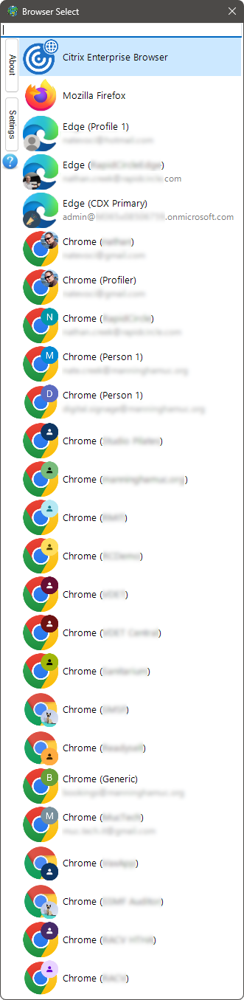

# Browser Select
Browser Select is a utility to dynamically select the browser you want instead of just having one default for all links. Similar to the prompt in android to choose a browser when a link in a non-browser app is clicked/touched. It may not be useful for everyone but it helps when you use multiple browsers for different things (e.g. one with proxy and one without) and open many links from other applications (e.g. Messengers).

or in vertical "Compact mode"

Instead of having to copy the link, open the desired (non-default) browser then pasting the link, all you need to do is to click on the link and this prompt will open allowing you to choose the browser you want. It automatically detects installed browsers. It does not require administrative rights and can be installed as a restricted user.

You may click on the desired browser or press one of the shortcuts (its index or the first letter of its name), for example for chrome you can press 2, g or c.
you may also press Esc (or click the X) to not open the URL.

To install Download this file then set it as the default browser.

BrowserSelect has been tested on windows 7, windows 8.1, windows 10, and windows 11. requires **.net framework 4.7.2**.

# Download

You can download browser select in the [releases](/releases/latest) section.

# Screenshots

Compact vertical mode. Useful if you have lots of profiles

Settings

URL Expander settings

# ToDo

Just a list of some ideas that can be integrated into BrowserSelect.
- [x] Make Settings persist across updates
- [x] Shift-Click to open link in incognito/private mode
- [ ] Option to display running browsers only
- [ ] More Auto-Select rule options
    - [ ] based on the source application
    - [ ] based on file extension
    - [x] based on URL path
    - [ ] based on keywords
    - [ ] ignoring the URL as an option
    - [ ] custom flags to browsers as an option (e.g. incognito mode or disable CSRF)
- [ ] export/import for rules/settings
- [ ] Sorting browsers on the list
- [ ] Custom Shortcuts
- [x] Ignoring the rules if Alt key is held down when clicking a link
- [ ] an API to invoke BrowserSelect
- [ ] Bugfix for when Browser was launched with Maximize window state (browser select will launch maximized)
- [ ] A browser extension to launch the correct browser based on the rules even if a link is clicked inside a browser
- [ ] support for portable browsers (adding browsers using a browse button rather than registry)
- [ ] support for non-browser apps as an option (e.g. download managers)
- [ ] themes ? or at least an optional transparent Aero glass mode
- [ ] Ability to choose custom icons for browsers
- [x] display the unshortened version of adf.ly or goo.gl links when selecting the browser
- [ ] Localization
- [ ] handling of other link types (e.g. `mail:` in case you have both outlook and thunderbird installed [or maybe as a sister app])
- [x] update checker (not as a popup or messagebox, a tiny icon somewhere on the main form that appears when you don't have the last version)
- [ ] add file associations (e.g. .url files, or .html files)
- [ ] record which browser you select for each domain and provide visual indicator of how often each browser is chosen for this domain

# Changelog

See [CHANGELOG.md](/CHANGELOG.md)

---

# Alternatives

- [Hurl](https://github.com/U-C-S/Hurl)
- [Browser Tamer](https://www.aloneguid.uk/projects/bt/)
- [Browser Choose 2](https://browserchooser2.com/)
- [Browser Picker](https://github.com/mortenn/BrowserPicker)
- [Browser Selector](https://github.com/DanTup/BrowserSelector)

